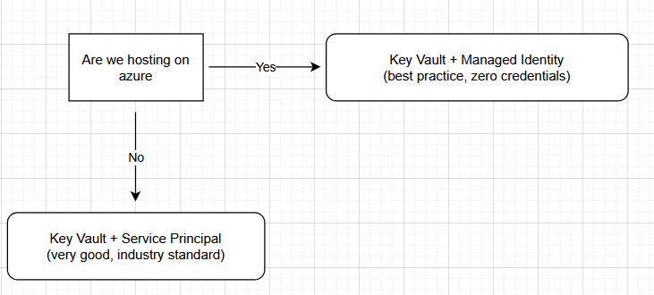

# 🏗 Azure Key Vault Architecture

## 1. Overview

This document defines the enterprise architecture for secure secret management using **Azure Key Vault** across Openserve application environments.

It establishes a standardized, identity-driven security model for secret storage, access control, and runtime retrieval using Azure-native services.

---

## 2. Objectives

- Centralize all application secrets in Azure Key Vault
- Eliminate `.env` files and embedded credentials
- Enable secure runtime secret retrieval
- Enforce identity-based access control (Zero Trust model)
- Provide full auditability of secret access across environments

---

## 3. Architecture Principles

- **Zero Trust Security Model**: No static credentials in application code
- **Identity-Based Access**: Managed Identity preferred over Service Principal
- **Separation of Concerns**: Applications, secrets, and infrastructure are decoupled
- **Environment Isolation**: Separate Key Vault per environment (Dev / Non-Prod / Prod)

---

## 4. High-Level Architecture

### Logical Flow

Application → Managed Identity → Azure Key Vault → Secure Secret Retrieval → Runtime Injection

---

### Best Practice - Two Authentication Options

---

## 5. Core Components

### Azure Key Vault

Centralized secure store for:

- Database credentials  
- API keys  
- Authentication secrets  
- Certificates and cryptographic material

---

### Azure App Service
- Hosts application workloads
- Uses Managed Identity for authentication
- Retrieves secrets at runtime securely

---

### Managed Identity
- System-managed Azure identity
- Eliminates need for stored credentials
- Authenticates applications to Azure services securely

---

### Role-Based Access Control (RBAC)
- Assigns **Key Vault Secrets User** role
- Enforces least-privilege access model
- Restricts secret access to authorized identities only

---

## 6. Authentication Decision Model

### Decision Matrix

---

### Authentication Strategy

| Scenario | Authentication Method | Rationale |
|----------|----------------------|------------|
| Azure-hosted workloads (App Service, Functions, Containers) | Managed Identity | Secure, no credentials required |
| External systems (CI/CD, local development, on-prem systems) | Service Principal | Required for non-Azure authentication |

---

## 7. Runtime Data Flow

1. Application starts in Azure App Service
2. Managed Identity is automatically assigned
3. Application requests secret from Azure Key Vault
4. Azure validates identity and RBAC permissions
5. Secret is securely returned at runtime
6. Secret is used in memory only (no persistence)

---

## 8. Security Controls

- No secrets stored in source code or repositories
- No `.env` files deployed to any environment
- RBAC enforced at Key Vault level
- All access logged via Azure Monitor (audit trail)
- Secret rotation supported without application redeployment

---

## 9. Environment Strategy

Each environment is fully isolated:

- **Development** → Feature development and testing
- **Non-Production** → Integration and validation testing
- **Production** → Live customer workloads

Each environment includes:
- Dedicated Key Vault instance
- Independent identity assignments
- Isolated secret namespaces

---

## 10. Benefits

This architecture delivers:

- 🔐 Reduced credential exposure risk
- ⚙️ Centralized and consistent secret management
- 📊 Improved compliance posture (Zero Trust alignment)
- 🔄 Simplified secret rotation lifecycle
- 👁️ Full audit visibility of secret access

---

## 11. Operational Considerations

- RBAC changes may take time to propagate
- Application restart may be required after secret updates
- Key Vault reference strings are case-sensitive
- Misconfiguration results in runtime resolution failures

---

## 12. Conclusion

Azure Key Vault enables a secure, scalable, and enterprise-grade secrets management architecture based on identity and Zero Trust principles.

This eliminates dependency on insecure configuration patterns such as `.env` files and ensures consistent, auditable secret handling across all environments.
